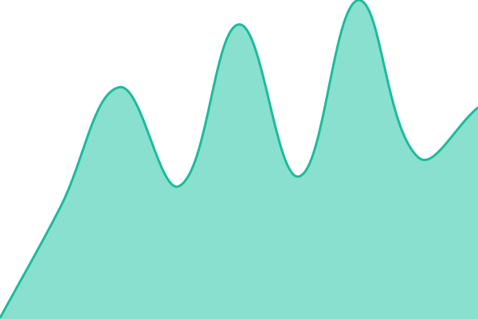
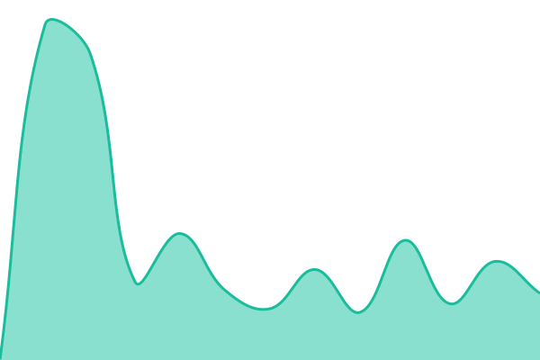
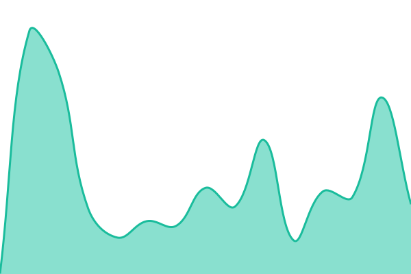
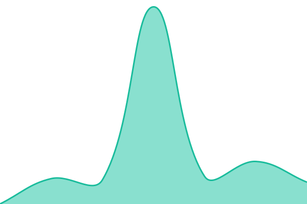
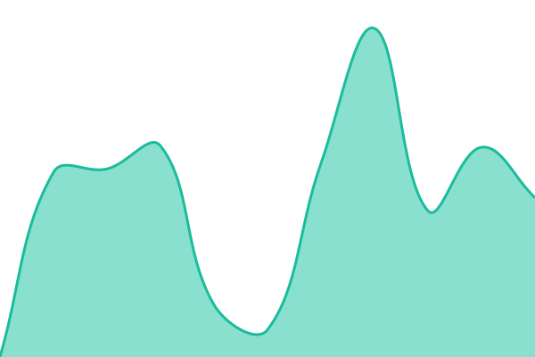

# [📈 Live Status](https://status.ankerd.org): <!--live status--> **🟩 All systems operational**

This repository contains the open-source uptime monitor and status page for [gavin132\_](https://status.ankerd.org), powered by [Upptime](https://github.com/upptime/upptime).

With [Upptime](https://upptime.js.org), you can get your own unlimited and free uptime monitor and status page, powered entirely by a GitHub repository. We use [Issues](https://github.com/Gavin132/status.ankerd.org/issues) as incident reports, [Actions](https://github.com/Gavin132/status.ankerd.org/actions) as uptime monitors, and [Pages](https://status.ankerd.org) for the status page.

<!--start: status pages-->
<!-- This summary is generated by Upptime (https://github.com/upptime/upptime) -->
<!-- Do not edit this manually, your changes will be overwritten -->
<!-- prettier-ignore -->
| URL | Status | History | Response Time | Uptime |
| --- | ------ | ------- | ------------- | ------ |
|  [ankerd.nl - Main website](https://ankerd.nl) | 🟩 Up | [ankerd-nl-main-website.yml](https://github.com/Gavin132/status.ankerd.org/commits/HEAD/history/ankerd-nl-main-website.yml) | 

 139ms
     
 | 

<a href="https://status.ankerd.org/history/ankerd-nl-main-website">100.00%</a>
    

|  [pws.ankerd.nl - A Mandelbrot simulation site](https://pws.ankerd.nl) | 🟩 Up | [pws-ankerd-nl-a-mandelbrot-simulation-site.yml](https://github.com/Gavin132/status.ankerd.org/commits/HEAD/history/pws-ankerd-nl-a-mandelbrot-simulation-site.yml) | 

 276ms
     
 | 

<a href="https://status.ankerd.org/history/pws-ankerd-nl-a-mandelbrot-simulation-site">100.00%</a>
    

|  [soc.ankerd.nl - Scheikunde moppen](https://soc.ankerd.nl) | 🟩 Up | [soc-ankerd-nl-scheikunde-moppen.yml](https://github.com/Gavin132/status.ankerd.org/commits/HEAD/history/soc-ankerd-nl-scheikunde-moppen.yml) | 

 256ms
     
 | 

<a href="https://status.ankerd.org/history/soc-ankerd-nl-scheikunde-moppen">100.00%</a>
    

|  [con.ankerd.org - Convention management application](https://con.ankerd.org) | 🟩 Up | [con-ankerd-org-convention-management-application.yml](https://github.com/Gavin132/status.ankerd.org/commits/HEAD/history/con-ankerd-org-convention-management-application.yml) | 

 2409ms
     
 | 

<a href="https://status.ankerd.org/history/con-ankerd-org-convention-management-application">100.00%</a>
    

|  [dev.ankerd.org - Convention management application BETA](https://dev.ankerd.org) | 🟩 Up | [dev-ankerd-org-convention-management-application-beta.yml](https://github.com/Gavin132/status.ankerd.org/commits/HEAD/history/dev-ankerd-org-convention-management-application-beta.yml) | 

 2121ms
     
 | 

<a href="https://status.ankerd.org/history/dev-ankerd-org-convention-management-application-beta">100.00%</a>
    

|  [cdn.ankerd.org - CDN](https://cdn.ankerd.org/story-photos/0000000000553E25.jpg) | 🟩 Up | [cdn-ankerd-org-cdn.yml](https://github.com/Gavin132/status.ankerd.org/commits/HEAD/history/cdn-ankerd-org-cdn.yml) | 

 759ms
     
 | 

<a href="https://status.ankerd.org/history/cdn-ankerd-org-cdn">100.00%</a>
    

|  [nextcloud.ankerd.org - Nextcloud](https://nextcloud.ankerd.org) | 🟩 Up | [nextcloud-ankerd-org-nextcloud.yml](https://github.com/Gavin132/status.ankerd.org/commits/HEAD/history/nextcloud-ankerd-org-nextcloud.yml) | 

 1541ms
     
 | 

<a href="https://status.ankerd.org/history/nextcloud-ankerd-org-nextcloud">100.00%</a>
    

|  [wordpress.ankerd.org - Portfolio site](https://wordpress.ankerd.org) | 🟩 Up | [wordpress-ankerd-org-portfolio-site.yml](https://github.com/Gavin132/status.ankerd.org/commits/HEAD/history/wordpress-ankerd-org-portfolio-site.yml) | 

 1255ms
     
 | 

<a href="https://status.ankerd.org/history/wordpress-ankerd-org-portfolio-site">100.00%</a>
    

<!--end: status pages-->

[**Visit our status website →**](https://status.ankerd.org)

## 📄 License

- Powered by: [Upptime](https://github.com/upptime/upptime)
- Code: [MIT](./LICENSE) © [Anand Chowdhary](https://anandchowdhary.com)
- Data in the `./history` directory: [Open Database License](https://opendatacommons.org/licenses/odbl/1-0/)
